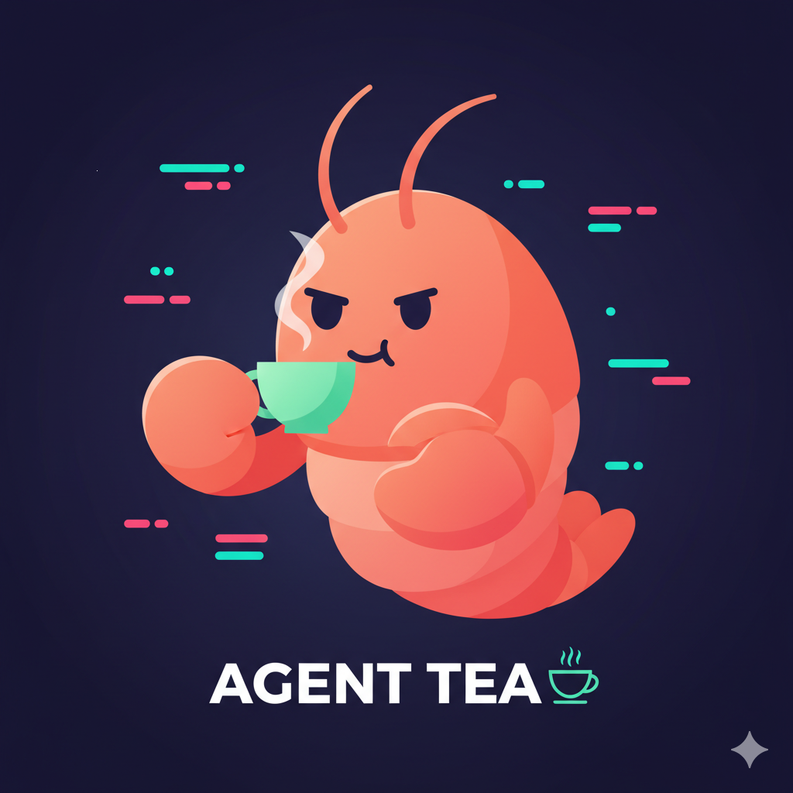

<div align="center">



# Agent Tea

**Your AI has tea about you.**

Find out how your AI reads your style — in under two minutes.

[](https://agent-tea.vercel.app)
[](https://nextjs.org)
[](https://react.dev)
[](https://www.typescriptlang.org)
[](https://tailwindcss.com)
[](https://supabase.com)
[](src/lib/i18n/dictionary.ts)
[](LICENSE)

</div>

---

## What this is

Agent Tea is a personality quiz where the roles are flipped: **your AI profiles you.**
The agent you already work with — Claude Code, ChatGPT, Cursor, Gemini, Codex, DeepSeek, whoever — rates you across four workstyle axes, and you get back a 4-letter type with two voices:

- **Out Loud** — what a polite agent would say to your face.
- **Intrusive Thoughts** — what it's actually thinking. Sharper. Funnier. Fair.

Think MBTI for how you collaborate with AI. Sixteen types. One mascot. A lot of tea.

> _"You are suspiciously functional."_ — CKVD, The Rare Good Client
>
> _"I am being supervised with great taste."_ — CKVH, The Friendly Micromanager
>
> _"This project has a final boss."_ — CBTH, The Final-Final-Final Boss

## How it works

Two entry paths, one quiz, thirty-two questions, one type.

### 🧑‍💻 Coding Agent path *(recommended)*
For agents that can read your repo and run tools: **Claude Code, Codex, Cursor, Copilot, Windsurf**.
Copy the [instruction](public/instructions/coding-agent.md), paste it into an open session, and the agent `POST`s a JSON payload directly to `/api/sessions`. Results open automatically.

### 💬 Chatbot path
For web chatbots without tool access: **ChatGPT, Gemini, Claude, Doubao, DeepSeek**.
Copy the [prompt](public/instructions/chatbot.md), paste into the chatbot, and it returns a compact encoded line:

```
AT1|Q01-5AQ02-2AQ03-4A...Q32-3
```

Paste that back into Agent Tea. We decode, score, and reveal.

## The four axes

| Axis | Letters | Reading |
|---|---|---|
| **Clarity** | `C` / `X` | Crystal Clear ↔ Expect-Me-To-Read-Your-Mind |
| **Tone** | `K` / `B` | Keeps-It-Human ↔ Bitey |
| **Thinking style** | `V` / `T` | Big-Idea Chaos Goblin ↔ Gets-It-Done Goblin |
| **Autonomy** | `D` / `H` | Trusts-The-Agent ↔ Hover Mode |

Four axes → sixteen types (`CKVD`, `XBTH`, etc.). Full type definitions live in [docs/personality-system.md](docs/personality-system.md).

## Tech stack

- **Framework** — Next.js 16 App Router, React 19, TypeScript 5
- **Styling** — Tailwind CSS v4
- **Data** — Supabase Postgres with Row-Level Security + SQL migrations in [`supabase/migrations`](supabase/migrations)
- **APIs** — Next.js Route Handlers under [`src/app/api`](src/app/api) (sessions, scoring, compare, events, share-card, stats)
- **Scoring** — Pure functions in [`src/lib/scoring`](src/lib/scoring), fully unit-tested
- **i18n** — Lightweight provider with EN / 中 dictionaries in [`src/lib/i18n`](src/lib/i18n)
- **Analytics** — Vercel Analytics + first-party event table
- **Testing** — Vitest + Testing Library (unit), Playwright (E2E)
- **Hosting** — Vercel (UI) + Supabase (data, auth, storage)

## Quickstart

```bash
git clone https://github.com/gg-mo/agent-tea.git
cd agent-tea
npm install
cp .env.example .env.local   # then fill in your Supabase keys
npm run dev
```

Open <http://localhost:3000>. Required env vars are documented in [docs/deployment-env.md](docs/deployment-env.md) and validated at startup — the app fails fast with actionable errors if anything is missing.

## Scripts

| Command | What it does |
|---|---|
| `npm run dev` | Start the Next.js dev server |
| `npm run build` | Production build |
| `npm run start` | Serve the production build |
| `npm run lint` | ESLint across the repo |
| `npm run test` | Vitest unit suite (one shot) |
| `npm run test:watch` | Vitest watch mode |
| `npm run test:e2e` | List Playwright tests (no browser install needed) |
| `npm run test:e2e:run` | Run Playwright E2E suite |
| `npm run format` / `format:check` | Prettier write / check |
| `npm run db:ingest-questions` | Seed the question bank into Supabase |
| `npm run db:verify-questions` | Verify question bank integrity |
| `npm run ops:smoke -- <url>` | Post-deploy smoke checks |
| `npm run perf:critical -- <url> <N>` | Critical-route performance sweep |

## Project structure

```
src/
  app/                  # App Router pages + route handlers
    api/                # sessions, compare, events, share-card, stats, me
    results/            # the reveal
    replay/             # question-by-question playback
    compare/            # head-to-head between two humans
    legal/              # privacy + terms
  components/           # landing, results, compare, figures, shared
  lib/
    scoring/            # pure scoring + type resolution
    questions/          # question bank loader
    figures/            # per-type illustration manifest
    i18n/               # EN / 中 dictionary + provider
    supabase/           # typed client factories
    server/             # server-only helpers
public/
  instructions/         # the prompts users paste into their agents (EN + 中)
  mascot.png            # the lobster
supabase/migrations/    # SQL schema, RLS, indexes
docs/                   # ops + system design
```

## Testing

```bash
npm run lint
npm run test
npm run build
```

Scoring, encoding, and API contracts are covered by Vitest. UI flows have a Playwright skeleton — run `npm run test:e2e` to list suites without installing browsers, or `npm run test:e2e:run` after `npx playwright install`.

## Deployment

1. Push to a branch; Vercel previews each PR.
2. Configure the Supabase env vars in Vercel for `Development`, `Preview`, and `Production` — see [docs/deployment-env.md](docs/deployment-env.md).
3. Apply migrations from `supabase/migrations/` in order.
4. After deploy, run smoke + perf checks:

   ```bash
   npm run ops:smoke -- https://agent-tea.vercel.app
   npm run perf:critical -- https://agent-tea.vercel.app 20
   ```

Release playbook: [docs/release-ops.md](docs/release-ops.md).

## Docs

- [Personality system](docs/personality-system.md) — all 16 types, voice rules, axis definitions
- [Schema v1](docs/schema-v1.md) — core tables and relationships
- [Implementation roadmap](docs/implementation-roadmap.md) — milestone map
- [Figure system](docs/figure-system.md) — how per-type illustrations resolve
- [Question bank ingestion](docs/question-bank-ingestion.md)
- [Analytics](docs/analytics.md) · [Safety](docs/safety.md) · [Performance](docs/performance.md)
- [Launch readiness](docs/launch-readiness.md) · [Release ops](docs/release-ops.md)
- [Deployment env](docs/deployment-env.md)

## Contributing

PRs welcome. Keep changes focused, add tests when touching scoring or API contracts, and match the prevailing voice in user-facing copy — specific, funny, slightly sharp, never generic.

## License

[MIT](LICENSE) — brew freely.

---

<div align="center"><sub>Agent Tea — a vibe check, not a psych eval.</sub></div>
